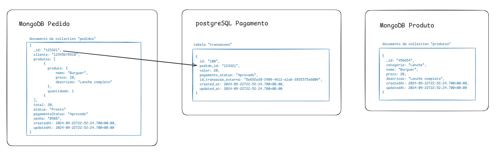

# Banco de dados
Projeto do curso de pós graduação da FIAP

Esse repositório é referente ao provisionamento do cluster do banco de dados gerenciado pelo Terraform.
<p>O serviço de banco de dados utilizado é o MongoDB Atlas.</p>
<p>Para gerenciamento do tfstate foi utilizado um bucket no Cloud Storage do Google Cloud Platform.</p>

## Secrets
Secrets cadastradas no repositório do GitHub

MongoDB Atlas
```bash
TF_VAR_PRIVATE_KEY
TF_VAR_PUBLIC_KEY
TF_VAR_DB_PEDIDO_USER
TF_VAR_DB_PEDIDO_USER_PASSWORD
TF_VAR_DB_PRODUTO_USER
TF_VAR_DB_PRODUTO_USER_PASSWORD
```
AWS
```bash
AWS_REGION
AWS_ACCESS_KEY_ID
AWS_SECRET_ACCESS_KEY
AWS_SESSION_TOKEN
TF_VAR_DB_PAGAMENTO_USER
TF_VAR_DB_PAGAMENTO_USER_PASSWORD
```
Google Cloud Platform
```bash
GCP_SA_KEY
```

## Desenho da modelagem banco de dados
